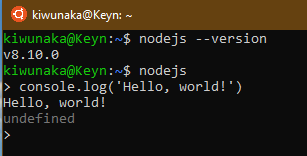

# About me

## Шимко Никита
#### [Python](https://www.python.org)
#### [JavaScript](https://ru.wikipedia.org/wiki/JavaScript)
#### [PascalABC](http://pascalabc.net)
#### [Github Pages]
### My id
[Vkontakte](https://vk.com/kiwunaka)
### Hello it's me


## Решение Задачи на Питоне

```python
print('Вывод списка : ')
lst = [0, 1, 1, 2, 3, 5, 8, 13, 21, 34, 55, 89, 144, 233, 377, 610, 987, 1597, 2584, 4181, 6765, 10946]
print(lst)
print('Вывод каждого второго числа из данного списка : ')
lst1 = lst[::2]
print(lst1)
print('Сумма данных чисел =', sum(lst1))
```

## Здесь находятся лабораторные по вебу:

1) [Лабораторная 1 по JS](https://github.com/NikitaSH999/webportfolio/blob/master/Screenshot_1.png) -- 

2) [Лабораторная XMl и DTD](https://github.com/NikitaSH-herzen/labXML)
	
##	Здесь находятся лабораторные по ПРОГ:
