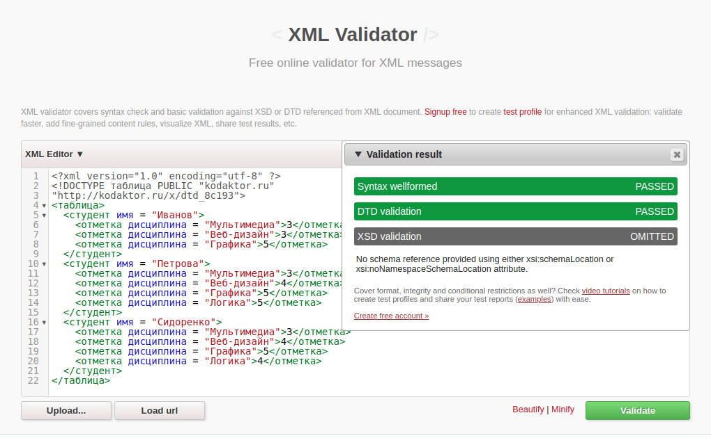

# Результат валидации xml документа

# Код xml
## [Ссылка на kodaktor с xml](https://kodaktor.ru/?!=xml_50a24)
[файл xml1.xml](https://github.com/NikitaPO/js1dtd/blob/master/part1/xml1.xml)

# Код DTD
## [Ссылка на kodaktor с dtd](https://kodaktor.ru/?!=dtd_8c193)
[файл dtd1.xml](https://github.com/NikitaPO/js1dtd/blob/master/part1/DTD1.xml)
