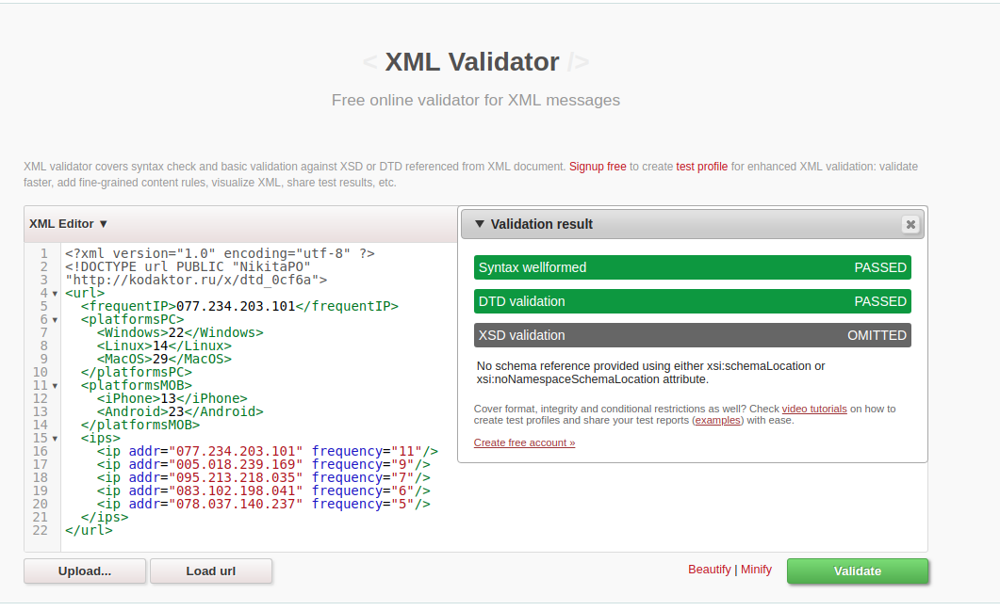

# Задание 3
# Результат валидации xml документа

# Код xml
## [Ссылка на kodaktor с xml](https://kodaktor.ru/?!=xml_50a24)
[файл xml3.xml](https://github.com/NikitaPO/js1dtd/blob/master/part3/xml3.xml)

# Код DTD
## [Ссылка на kodaktor с dtd](https://kodaktor.ru/?!=xml_43c6b)
[файл dtd3.xml](https://github.com/NikitaPO/js1dtd/blob/master/part3/DTD3.xml)
